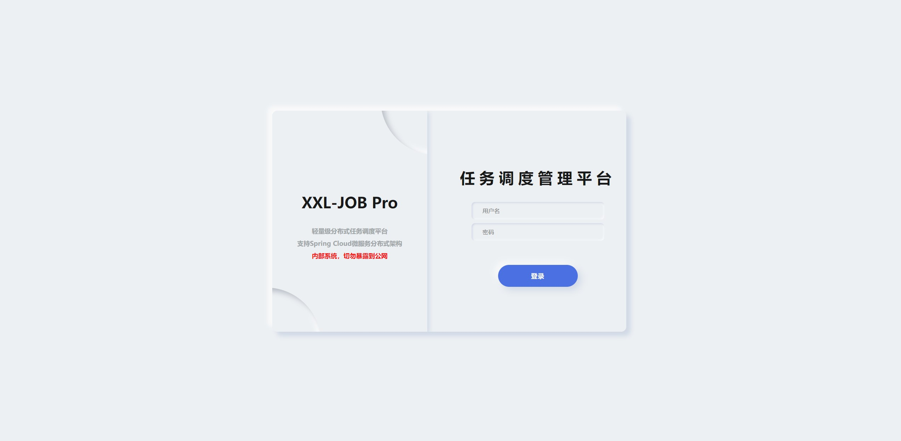
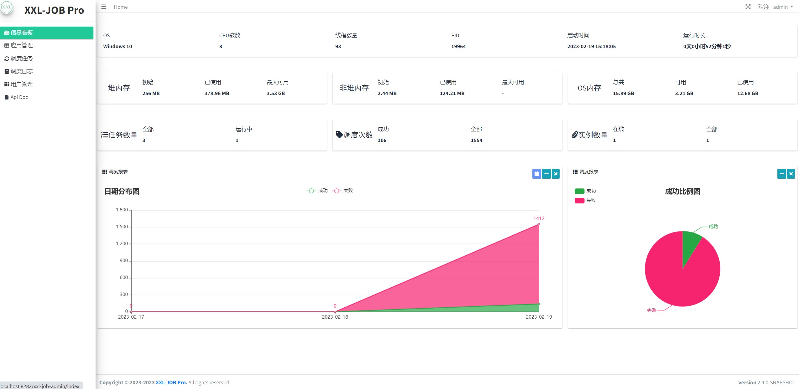
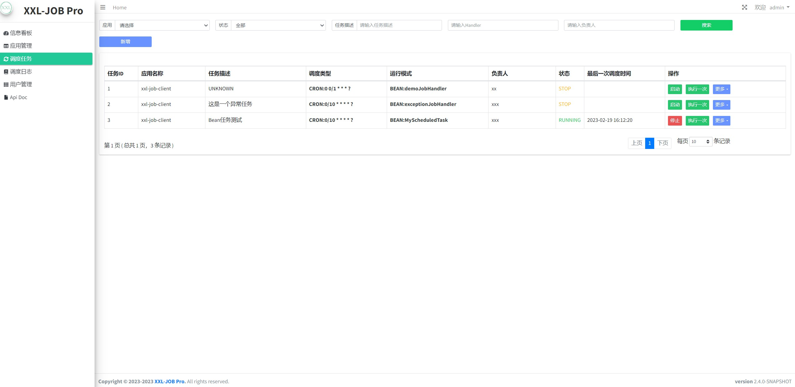

# XXL-JOB Pro
<p align="center" >
    <p align="center">
        <a href="https://github.com/sweeterBox/xxl-job-pro/releases">
         
        </a>
        <a href="https://github.com/sweeterBox/xxl-job-pro/">
            
        </a>
        <a href="https://hub.docker.com/r/sweeter/xxl-job-pro-admin/">
            
        </a>
        <a href="http://www.gnu.org/licenses/gpl-3.0.html">
         
        </a>
    </p>
</p>

>forked from xuxueli/xxl-job(2.4.0-SNAPSHOT)

>基于XXL-JOB项目二次开发,由于变动较大不准备申请合并到XXL-JOB仓库，后续将独立维护

## Git仓库
- [Github]()
- [Gitee](https://gitee.com/sweeter-open/xxl-job-pro)
## 简介

  出于学习[XXL-JOB](https://github.com/xuxueli/xxl-job)的目的,作者尝试编码了XXL-JOB Pro，主要目的是让XXL-JOB更好的和Spring Cloud架构融合。

## 原XXL-JOB文档

- [XXL-JOB](https://github.com/xuxueli/xxl-job/blob/master/README.md)  
- [XXL-JOB官方文档](https://www.xuxueli.com/xxl-job/#%E3%80%8A%E5%88%86%E5%B8%83%E5%BC%8F%E4%BB%BB%E5%8A%A1%E8%B0%83%E5%BA%A6%E5%B9%B3%E5%8F%B0XXL-JOB%E3%80%8B)

## 已修改的功能点
- 后端mybatis切换为spring-data-jpa
- 客户端实例服务（执行器）自动发现,支持spring cloud自动发现client执行服务
- 客户端端口与Web端口融合,支持只需一个端口对外开放
- 任务自动发现
- UI界面美化
- 前端与后端代码分离，便于重写前端UI
- 添加swagger接口文档
- 增加任务监控回调api hook，实现邮件、钉钉及飞书的通知消息
- 增加监控参数包括内存、网络、磁盘等
- Docker 镜像支持amd64(x86)、arm/v8 、arm/v7架构
- 客户端监控，内存、任务数量等，便于服务端合理的调度任务
- 编写客户端执行器starter，便于springboot项目集成
- 增加项目启动时任务自动注册功能

## 待修改功能点

- 管理端与客户端之间交互接口添加sign鉴权
- 在修改的过程中一些功能不可用了，将在后期的版本中重新实现
- 用户登录支持oauth2、LDAP
- tomcat->netty springMvc ->webflux
- 优化执行器的执行日志，最好能在admin中实时显示  
- 前端使用vue重新构建编写
- 故障转移
- 兼容测试xxl-job的客户端，便于阶段性升级
- 考虑支持Kettle ETL工具
## 原则及注意事项
- 非必要不引入新的中间件，越简单越好

## 接口文档
- URL：http://ip:port/xxl-job-admin/doc.html

## Supported database

  | Database      |Version  | Driver class name                          |Driver included |ID策略        |备注    |
  | :---          |:---:    |:---:                                       |:---:           |:----:         |:----:  |
  | MariaDB       | 10.6.x  |org.mariadb.jdbc.Driver                     |   Y            | auto increment|  支持  |
  | MySQL         | 5.7/8.0+|org.mariadb.jdbc.Driver                     |   Y            | auto increment|  支持  |
  | Oracle        | -       |oracle.jdbc.driver.OracleDriver             |   Y            | sequence      |  支持  |
  | PostgresSQL   | -       |org.postgresql.Driver                       |   Y            | auto increment|  支持  |
  | H2            | -       |org.h2.Driver                               |   Y            | auto increment|  支持  |
  | OceanBase     | -       |-                                           |                | auto increment|  待测试|
  | TiDB          | -       |-                                           |                | auto increment|  待测试|
  | SqlServer     | -       |com.microsoft.sqlserver.jdbc.SQLServerDriver|   Y            | auto increment|  待测试|
## 功能预览(暂无)
- 系统初始用户:admin 密码:xxljob
- 登录页


- 首页信息看板


- 任务调度管理


## Docker 

### 镜像制作
```shell script
mvn clean install -pl xxl-job-admin-cloud  -am  -Dmaven.test.skip=true

docker buildx build --platform linux/amd64,linux/arm64/v8,linux/arm/v7 -t sweeter/xxl-job-pro-admin:v1.0.0  --push ./xxl-job-admin-cloud/
```
### 镜像使用
- 从docker hub拉取镜像并创建容器
```shell script
docker pull sweeter/xxl-job-pro-admin:latest
docker run --network=host --restart=always  --name xxl-job-pro-admin -d -v ./xxl-job-pro-admin/conf:/app/conf sweeter/xxl-job-pro-admin:latest
#or
docker run --restart=always  --name xxl-job-pro-admin -d -p 8282:8282 -v ./xxl-job-pro-admin/conf:/app/conf sweeter/xxl-job-pro-admin:latest
```
- 阿里云docker镜像仓


### docker-compose 编排
```yaml
version: '3'
services:
  xxl-job-pro-admin:
    container_name: xxl-job-pro-admin
    image: sweeter/xxl-job-pro-admin:latest
    ports:
      - 8282:8282
    environment:
      - TZ=Asia/Shanghai
      - JAVA_OPTS=-Dfile.encoding=UTF-8 -server -d64 -Xmx512g -Xms512g -Djava.security.egd=file:/dev/./urandom  -XX:+PrintGCDetails -XX:+PrintGCApplicationStoppedTime -XX:+PrintGCDateStamps -XX:+UseGCLogFileRotation -XX:GCLogFileSize=10M -XX:NumberOfGCLogFiles=10 -Xloggc:./logs/gc.log -XX:+UseG1GC -XX:+PrintTenuringDistribution -XX:+HeapDumpOnOutOfMemoryError -XX:HeapDumpPath=./logs/dump.hprof
      - nacos.namespace=${NACOS_NAMESPACE}
      - nacos.server-addr=${NACOS_SERVER_ADDR}
      - nacos.username=${NACOS_USERNAME}
      - nacos.password=${NACOS_PASSWORD}
      - nacos.group=${NACOS_GROUP}
      - port=8282
    network_mode: host
    restart: always
```
- 环境变量
```shell script
export NACOS_NAMESPACE=XXL
export NACOS_SERVER_ADDR=127.0.0.1:8848
export NACOS_USERNAME=nacos
export NACOS_PASSWORD=nacos
export NACOS_GROUP=DEFAULT_GROUP
```
- 拉取镜像并后台运行
```shell script
docker-compose up -d
```
## 环境变量及属性

  | key      | 描述   | 可选值  |默认值 |
  | :---          |:---:   |:----:   |:----:|
  | port  | 服务端口 | -    |  8282  |
  | context-path  | - | -    |  /xxl-job-admin  |
  | cloudEnabled  | 是否是微服务环境 | true/false    |  true  |
  | nacos.namespace | nacos名称空间 | -    |  XXL  |
  | nacos.server-addr | nacos地址 |  -   |  -  |
  | nacos.group | nacos分组 | -    |  DEFAULT_GROUP  |
  | nacos.password | nacos密码 | -    |  nacos  |
  | nacos.username | nacos用户名 | -    |  nacos  |
  | database.platform  | 数据库平台类型 | h2/mysql/oracle/postgresql    |  h2  |
  | database.username  | 数据库登录用户名 | -    |  -  |
  | database.password  | 数据库登录密码 | -    |  -  |
  | database.url  | 数据库jdbc地址 | -    |  -  |
  | -  | - | -    |  -  |
  
## 使用方法

### 单机环境使用


### spring-cloud 微服务架构环境使用

- spring-cloud-alibaba项目中引入如下maven依赖
```xml
<dependency>
    <groupId>com.github</groupId>
    <artifactId>spring-boot-xxl-job-starter-nacos-client</artifactId>
    <version>1.0.0</version>
</dependency>
```
- 支持的nacos版本 v2.0.3

### XXL-JOB升级至XXL-JOB Pro方案
- TODO

## 消息通知

### 邮件
- 如果启用了邮件通知配置，在任务调度或执行失败时，会触发通知事件下发邮件通知。
- 配置方法
```yaml
xxl:
  job:
    notify:
      mail:
        additional-properties:
          sign: 'XXL-JOB Pro Admin - by sweeter'
        # 逗号分隔的抄送收件人列表
        #cc: zhangsan@xxl.com
        enabled: false
        from: robot@xxl.com
        to: sweeter@xxl.com
```

### 飞书
- 如果启用了飞书通知配置，在任务调度或执行失败时，会触发通知事件通过飞书群组机器人下发通知。
- 配置方法
```yaml
xxl:
  job:
    notify:
      feishu:
        enabled: false
        secret: YZp84h85w3rYL7X2R2ly0g
        # hook地址
        webhookUrl: 'https://open.feishu.cn/open-apis/bot/v2/hook/48b79606-ca5b-4ab7-beee-11009d6c94fb'
        # 需要发送的文本信息
        message: "任务：#{event.task.description} \n作者：#{event.task.author} \n客户端实例地址：#{event.log.instanceUrl} \n调度状态：#{event.log.triggerStatus} \n执行状态：#{event.log.handleStatus}"
```

### webhook
- 如果启用了webhook通知配置，在任务调度或执行失败时，会触发通知事件通过http post请求下发通知。
- 配置方法
```yaml
xxl:
  job:
    notify:
      webhook:
        enabled: true
        # hook地址 http method:POST content-type:application/json 
        webhookUrl: 'http://localhost:8282/xxl-job-admin/webhook/test'
        # 需要发送的文本信息
        message: "任务：#{event.task.description} \n作者：#{event.task.author} \n客户端实例地址：#{event.log.instanceUrl} \n调度状态：#{event.log.triggerStatus} \n执行状态：#{event.log.handleStatus}"
```
